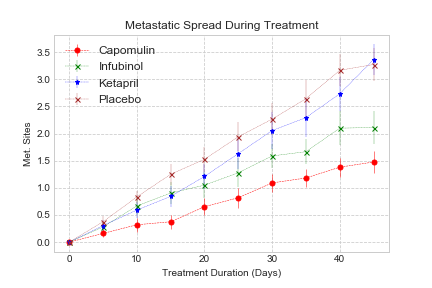
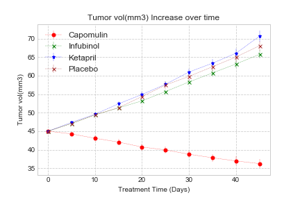
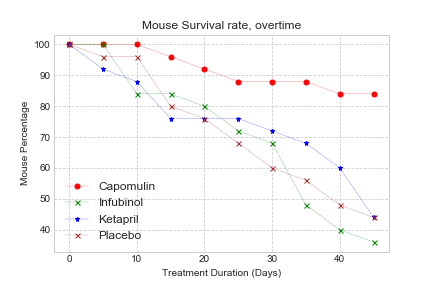

# Pymarcelthics-Drug_Test_Analysis

# Background
While your data companions rushed off to jobs in finance and government, you remained adamant that science was the way for you. Staying true to your mission, you've since joined Pymaceuticals Inc., a burgeoning pharmaceutical company based out of San Diego, CA. Pymaceuticals specializes in drug-based, anti-cancer pharmaceuticals. In their most recent efforts, they've since begun screening for potential treatments to squamous cell carcinoma (SCC), a commonly occurring form of skin cancer.

As their Chief Data Analyst, you've been given access to the complete data from their most recent animal study. In this study, 250 mice were treated through a variety of drug regimes over the course of 45 days. Their physiological responses were then monitored over the course of that time. Your objective is to analyze the data to show how four treatments (Capomulin, Infubinol, Ketapril, and Placebo) compare.

# Goals
Creating a scatter plot that shows how the tumor volume changes over time for each treatment.

Creating a scatter plot that shows how the number of metastatic (cancer spreading) sites changes over time for each treatment.

Creating a scatter plot that shows the number of mice still alive through the course of treatment (Survival Rate)

#

# Findings

Of the four treatments examined, only Capomulin showed a decrease in overall tumor size throughout the study period.
Despite decreasing tumor size, Capomulin did not stop the spread of metastaic sites. However it did have the lowest rate of metastic spread of the four treatments.

Treatment including Capomulin exhibits slower decrease in survival rates.
Ketapril appears to have no better outcome than the placebo.

